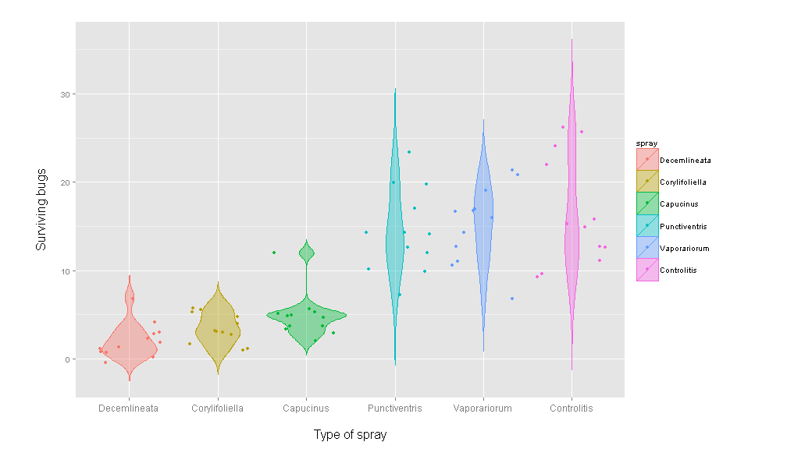

To Kill a Busy Bug
========================================================
author: Developing Data Products, Coursera Data Science
date: Peer Assesment Project, August 2014
css: bug.css
font-import: http://fonts.googleapis.com/css?family=Dosis
font-import: http://fonts.googleapis.com/css?family=Bilbo
font-family: 'Dosis', sans-serif;
transition: rotate

<div id="stage2">
<div id="traveler2">
<div id="bouncer2"></div>
</div>
<div id="traveler3">
<div id="bouncer3"></div>
</div>
</div>


Let the data help you choose the best bug spray!
========================================================

<small>This is how data science can help the process of getting rid of those annoying buzzing buggers. This application is based on **real research data** (read more in this [PDF document](http://www.jstor.org/stable/2332128?origin=JSTOR-pdf)), offers the user a possibility to compare 3 different bug sprays, and choose the most efficient one.</small>

<small id="mini">Sprays used in the original research had a non-descriptive names (A, B, C...), but for the purpose of this application we decided to substitute them with some funny Latin ones.

New spray name  | Original value
------------- | -------------
Punctiventris  | A
Vaporariorum  | B
Decemlineata  | C
Capucinus  | D
Corylifoliella  | E
Controlitis  | F
</small>


What happens behind the scene
========================================================
transition: zoom

<small>After choosing the 3 sprays to compare, user will receive the prediction of spray efficiency. Here is a code snippet:</small> 


```r
# prediction 1st chosen spray
output$spray1Summary <- renderText({paste(input$spray3, 'will probably leave around', round(mean(spraydf$count[spraydf$spray == input$spray1])), 'bugs still alive.')})
# prediction 2nd & 3rd chosen spray
```

<small>**Controlitis** spray will probably leave around **17** bugs still alive.</br>
**Punctiventris** spray will probably leave around **14** bugs still alive.</br>
**Decemlineata** spray will probably leave around **2** bugs still alive.</small></br></br>

<span id="rezultat">Seems that the winner is Decemlineata bug spray!</span>


Check the graph and compare side by side
========================================================
transition: zoom


 


Where can you get it
========================================================
transition: rotate


<small>You can start using <b>To Kill a Busy Bug</b> application here: 
<a ref='http://ddgthub.shinyapps.io/KIllBusyBug/'>http://ddgthub.shinyapps.io/KIllBusyBug/</a></small>

<small>If you are interested in original research, check the paper published in the journal **Biometrika** in 1942:</small></br>
 

<small>[<b>Beall, G.</b>, (1942), <em>The Transformation of data from entomological field experiments</em>, Biometrika, 29, 243-262.</a>](http://www.jstor.org/stable/2332128?origin=JSTOR-pdf)</small>


